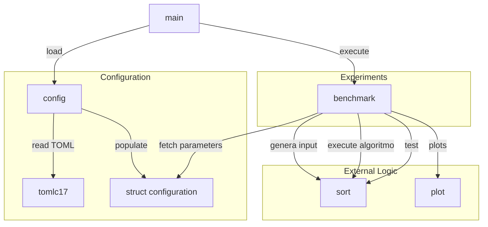
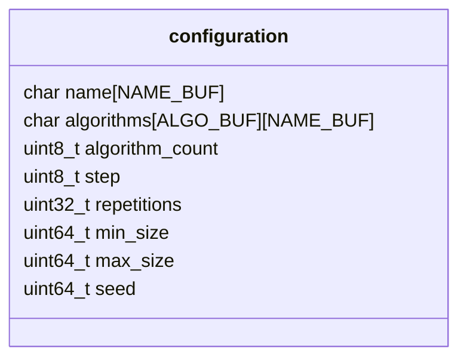
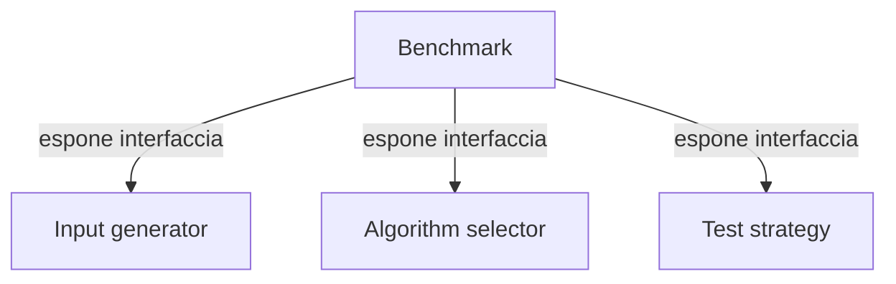
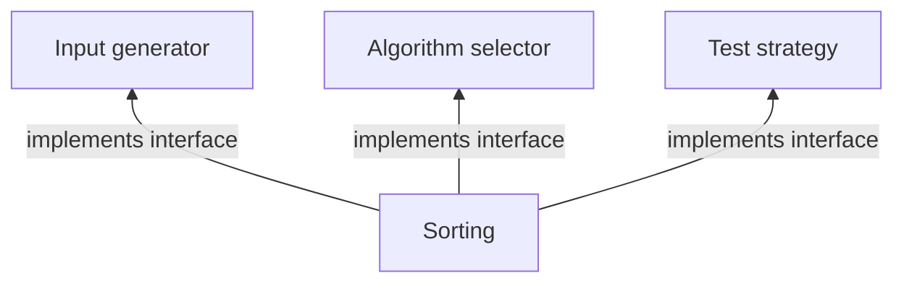

# sorting algorithms

One of the two workshops offered for the Algorithms and Data Structures course at the University of Ferrara.

This is a modular benchmarking framework for comparing various optimizations across sorting algorithms.

The following algorithms are implemented:

- insertion sort;
- merge sort;
- hybrid insertion-merge sort;
- quick sort;
- quick sort with median-of-three partition;
- tail-recursive quicksort;
- hybrid insertion-quick sort;
- heap sort;
- tim sort;
- introspective sort.

You can customize your benchmarking via a configuration file (see the Usage section).
The running time of each algorithm is printed as an explicit matrix in the results folder;
optionally, if gnuplot is installed on your system, a plot is generated too.

Certain algorithms are designed to exploit existing patterns in data (e.g., tim sort);
you can customize how testing inputs are generated by implementing your own interface to the experiments (see the signatures in sort.h).

# Usage

Fill your configuration file by following the example in `config/config.toml.example`.
Run `make` and execute the binary, providing the relative path of your configuration as the second argument.

# Schema

This is an overview of the project.

The `Configuration` module has two responsibilities: defining the configuration structure and loading it. 
A possible example is given below.

The `main` function is the entry point of the programme and acts as the driver for the experiments.

The loading of the configuration is delegated to a `Configuration` module, which fills a structure (see above) to be passed to the `Experiments` module.

The experiments are responsible for:
    1. iterating through a list of algorithms whose performance is to be measured;
    2. for each algorithm, generating a random input;
    3. calling the algorithm and measuring its execution time;
    4. saving the measured time;
    5. checking the correctness of the algorithm;
    6. repeating step 2 as specified by the configuration;
    7. returning the average of the execution times.

Note that steps 1, 2, and 5 of the process above do not know in advance which logic to call.
A responsibility is therefore added to the `Experiments` module: that of exposing three interfaces.

The `External logic` module implements these interfaces.

Because of this, you could try to extend this package and also handle the benchmarking of more complex algorithms or operations of certain data structures.

Last but not least, we want to write the results.
The simplest way is to print them as a matrix in the results folder.
However, if available, `gnuplot` ([see here](http://webusers.fis.uniroma3.it/~meneghini/LPC/files_lezioni/Guida_gnuplot.htm)) is leveraged.

